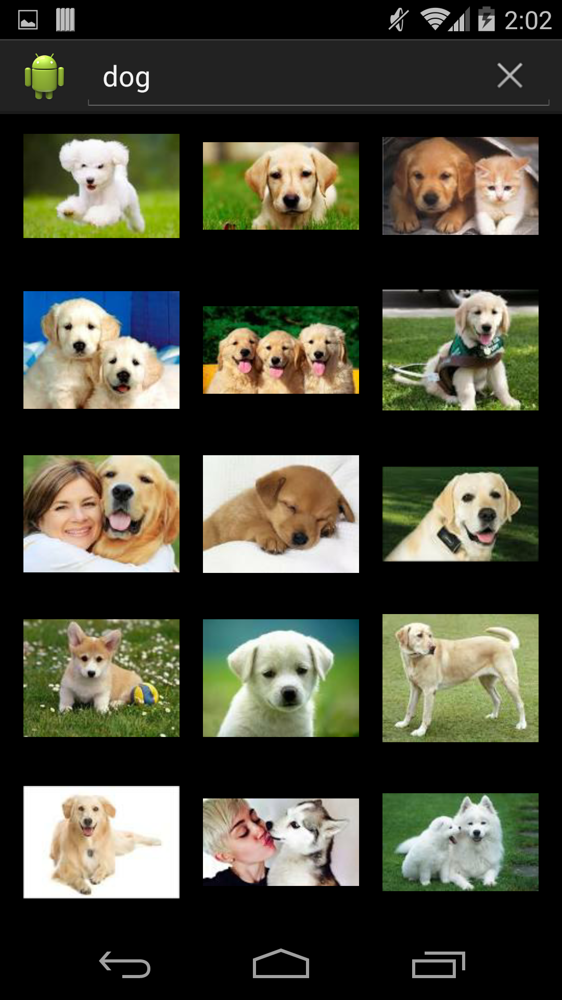
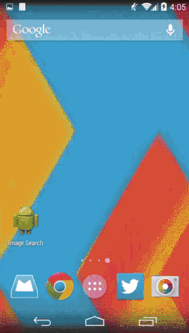

Image Search
============

Image Search is built around [Google image search API](https://developers.google.com/image-search/) and supports search for images and filtering them by size, color and type. It also support site specific image search.

&nbsp;

Features
--------

Image Search provides the following functionality:
* Search for images via Google by typing in a search query
* Filter search by image size, color and type
* Do an image search on a specific site
* View a grid of images and scroll down to load more
* View a large image by tapping it

Building
--------

You can build the app using Android Studio by following next steps:
* `git clone git@github.com:tomazsh/image-search-android-app.git`
* Open Android Studio and click “Import project”
* Select and open the `image-search-android-app` you’ve cloned from Github
* Build and run

Contributing
------------

All of your contributions are greatly appreciated. Feel free to open a pull request.

License
-------

All code is distributed under MIT license. See LICENSE file for more information.
